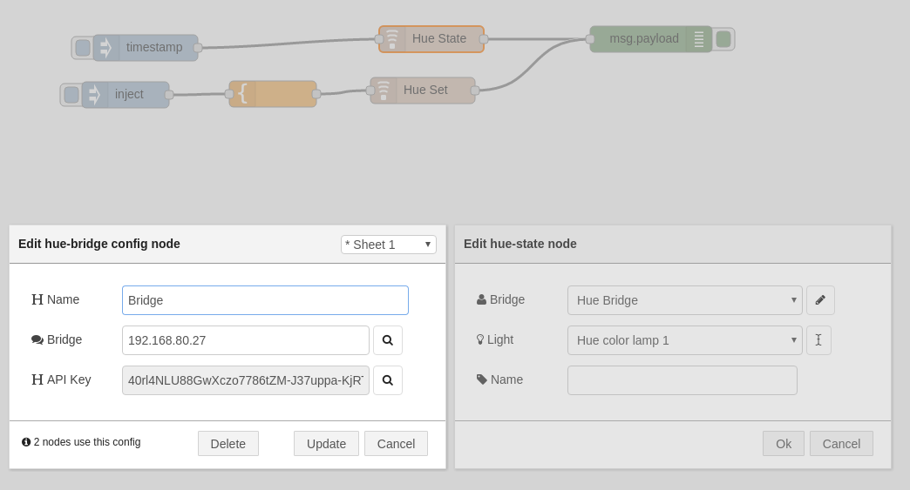

# Hue Node for Node RED
This is a complete rework of the original node-red-contrib-hue nodes by urbiworx.
Control you Hue Lamps out of Node RED.

## Installation
Just install this plugin to your Node Red installation by using npm: "npm install node-red-contrib-hueplus" in your Node Red root directory

## Usage
All you need to know is bundled with the installation: Just drag one of each of the hue nodes into your graph and read the manual displayed. Also no hassle to create a hue-user: just open the dialog, push the button on the bridge, select the hue server (is auto-discovered) and you are good to go.

## Example

```
[{"id":"215081ca.0d96fe","type":"hue-bridge","z":"e59733cf.1a68d","name":"","bridge":"192.168.80.27","key":"40rl4NLU88GwXczo7786tZM-J37uppa-KjRTYnIe"},{"id":"a5d7201b.118b1","type":"template","z":"e59733cf.1a68d","name":"","field":"payload","fieldType":"msg","format":"json","syntax":"mustache","template":"{\n    \"on\": true,\n    \"longAlert\": true\n}","x":321,"y":118,"wires":[["56267358.03f94c"]]},{"id":"f7254ea4.775d4","type":"inject","z":"e59733cf.1a68d","name":"","topic":"","payload":"","payloadType":"str","repeat":"","crontab":"","once":false,"x":152,"y":119,"wires":[["a5d7201b.118b1"]]},{"id":"8a22395f.57d948","type":"hue-state","z":"e59733cf.1a68d","bridge":"215081ca.0d96fe","light":"2","name":"","x":503,"y":55,"wires":[["2a2e86db.70edea"]]},{"id":"19182629.548b6a","type":"inject","z":"e59733cf.1a68d","name":"","topic":"","payload":"","payloadType":"str","repeat":"","crontab":"","once":false,"x":165,"y":65,"wires":[["8a22395f.57d948"]]},{"id":"2a2e86db.70edea","type":"debug","z":"e59733cf.1a68d","name":"","active":true,"console":"false","complete":"false","x":755,"y":55,"wires":[]},{"id":"56267358.03f94c","type":"hue-set","z":"e59733cf.1a68d","bridge":"215081ca.0d96fe","light":"g-0","name":"","x":506,"y":120,"wires":[["2a2e86db.70edea"]]}]
```

## Screenshots

Dialog:



## Contributors
- [urbiworx](https://github.com/urbiworx)
- [Jochen Scheib](https://github.com/mapero)
